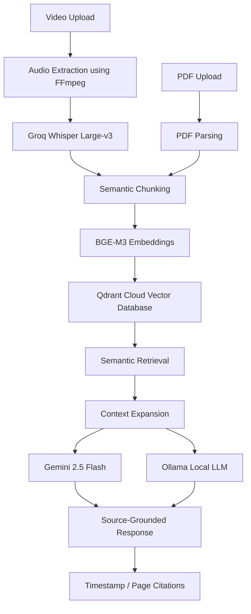

# 🚀 AI-Powered Multi-Modal Knowledge Retrieval System

<p align="center">
Transform Videos & PDFs into Searchable AI Knowledge Bases using Retrieval-Augmented Generation (RAG), Qdrant, Gemini, Ollama and Whisper.
</p>

<p align="center">


</p>

---

## 📌 Overview

AI-Powered Multi-Modal Knowledge Retrieval System is an advanced Retrieval-Augmented Generation (RAG) platform that transforms long-form educational videos and PDF documents into searchable semantic knowledge repositories.

The system combines speech recognition, semantic chunking, vector embeddings, semantic retrieval, and Large Language Models to generate grounded, explainable responses linked directly to their original sources.

Unlike conventional chatbots, responses are generated from retrieved evidence and supported by timestamp-level or page-level citations, significantly reducing hallucinations and improving answer reliability.

---

## 🎯 Why This Project?

Large Language Models often struggle with long-form content and domain-specific knowledge, frequently generating answers without verifiable evidence.

This project addresses that limitation by integrating semantic retrieval, vector databases, and hybrid LLM inference to provide source-grounded responses with explainable citations.

The result is an AI assistant capable of understanding and querying hours of lecture content and large document collections while maintaining traceability and transparency.

---

## 🏗️ System Architecture



---

## ✨ Key Features

### Multi-Modal Knowledge Retrieval

* Upload and query both video lectures and PDF documents through a unified interface.
* Automatically transforms unstructured multimedia content into searchable knowledge.
* Supports educational content, technical documentation, and research materials.

### Intelligent Retrieval Pipeline

* Semantic chunking with contextual overlap.
* Dense vector embeddings using BAAI/bge-m3.
* High-performance vector search powered by Qdrant Cloud.
* Context expansion for improved retrieval quality.

### Hybrid LLM Inference

* Gemini 2.5 Flash integration.
* Ollama-based local inference support.
* Flexible cloud/local deployment options.

### Explainable AI Responses

* Timestamp-level citations for video content.
* Page-level references for PDFs.
* Confidence scoring based on retrieval quality.
* Source-grounded responses designed to minimize hallucinations.

### Performance Optimizations

* GPU-accelerated embedding generation.
* Fast speech-to-text transcription using Groq Whisper Large-v3.
* Optimized indexing pipeline for large multimedia datasets.

---

## 📊 Benchmark Results

| Metric                        | Result                |
| ----------------------------- | --------------------- |
| Longest Video Processed       | 59 Minutes            |
| Transcript Segments Generated | 923                   |
| Semantic Chunks Created       | 90                    |
| End-to-End Processing Time    | ~83 Seconds           |
| Embedding Throughput          | 48.7 Chunks/sec       |
| Embedding Model               | BAAI/bge-m3           |
| GPU                           | NVIDIA RTX 4050       |
| Vector Database               | Qdrant Cloud          |
| Transcription Model           | Groq Whisper Large-v3 |

---

## 🖼️ Application Screenshots

### Upload Interface

<p align="center">

</p>

### AI-Generated Responses

<p align="center">

</p>

### Source-Grounded Citations

<p align="center">

</p>

---

## ⚙️ Technology Stack

### Programming

* Python

### Generative AI & LLMs

* Gemini 2.5 Flash
* Ollama
* Mistral-7B

### Retrieval & Search

* Retrieval-Augmented Generation (RAG)
* Semantic Search
* Qdrant Cloud
* BAAI/bge-m3 Embeddings
* Vector Similarity Search

### NLP

* Groq Whisper Large-v3
* Speech-to-Text Processing
* Semantic Chunking
* Context Expansion

### Infrastructure & Tools

* Streamlit
* CUDA
* FFmpeg
* Git

---

## 📂 Project Structure

```text
project/
│
├── app.py
├── run.py
├── process_video.py
├── process_pdf.py
├── query_engine.py
├── transformation.py
├── read_chunks.py
├── requirements.txt
├── index_summary.json
│
├── images/
└── README.md
```

---

## 🚀 Getting Started

### Clone Repository

```bash
git clone https://github.com/wahibkhannn/AI-Multimodal-Knowledge-Retrieval-System.git
cd AI-Multimodal-Knowledge-Retrieval-System
```

### Install Dependencies

```bash
pip install -r requirements.txt
```

### Configure Environment Variables

Create a `.env` file:

```env
GROQ_API_KEY=your_key_here
GEMINI_API_KEY=your_key_here
QDRANT_API_KEY=your_key_here
QDRANT_URL=your_qdrant_url
```

### Run Application

```bash
streamlit run app.py
```

---

## 🔮 Future Enhancements

* [ ] Hybrid Search (BM25 + Vector Search)
* [ ] Cross-Encoder Re-Ranking
* [ ] Multi-Document Collections
* [ ] Chat Memory
* [ ] Knowledge Graph Integration
* [ ] Agentic Retrieval Pipelines
* [ ] Research Paper Mode
* [ ] Multi-Language Support

---

## 👨‍💻 Author

**Mohammad Wahib Ashraf Khan**

B.Tech Computer Science & Engineering (Data Science)

* GitHub: https://github.com/wahibkhannn
* LinkedIn: https://linkedin.com/in/wahibkhannn

---

⭐ If you found this project interesting, consider starring the repository.

## License

Copyright © 2026 Mohammad Wahib Ashraf Khan

This project is proprietary software.
No permission is granted to copy, modify, distribute, or use this code without prior written consent.

